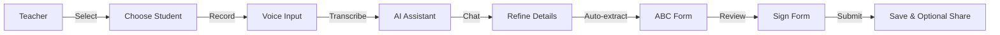
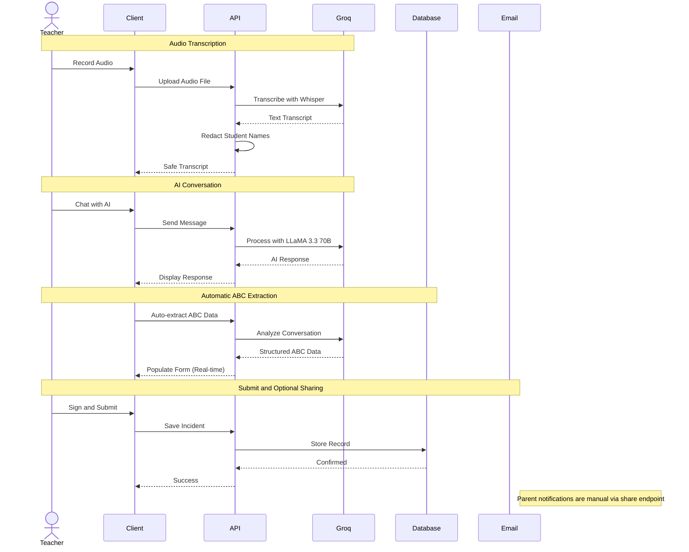
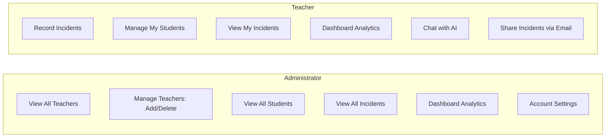

# ABCapture System Architecture Diagram

## System Architecture

## User Flow - Teacher Recording Incident

## Data Flow - Incident Recording Process

## Technology Stack

### Frontend
- React 18 with TypeScript
- Tailwind CSS + shadcn/ui
- TanStack Query (state management)
- Wouter (routing)
- Recharts (data visualization)
- Vite (build tool)

### Backend
- Node.js + Express.js
- TypeScript
- Passport.js (authentication)
- Drizzle ORM (database)
- Multer (file upload)
- Nodemailer (email)

### Database
- PostgreSQL
- Drizzle Kit (migrations)
- Session Store

### AI Services
- Groq Cloud
  - Whisper Large v3 (speech-to-text)
  - LLaMA 3.3 70B Versatile (chat & ABC extraction)

### Authentication
- Local (email/password with bcrypt)
- Google OAuth 2.0
- Express sessions

## System Components

### Frontend Components
- Authentication (login, signup, OAuth)
- Navigation (sidebar, routing)
- Forms (student, incident, ABC)
- Dashboards (teacher, admin)
- Voice Input (audio recording)
- Chat Interface (AI assistant)

### Backend Services
- Auth Service (authentication, authorization)
- Storage Service (database operations)
- Email Service (notifications)
- AI Service (Groq integration)
- PII Redaction (privacy protection)

### Data Layer
- Users (teachers, admins - authenticated users only)
- Students (student records)
- Incidents (behavioral records)
- Edit History (audit trail)

## Role-Based Access Control

